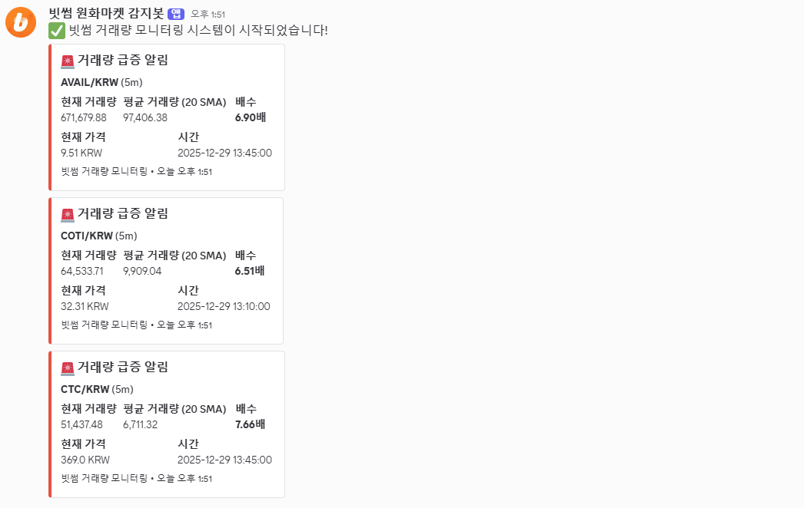

## 📝 프로젝트 소개 (Executive Summary)

> **"빗썸 KRW 마켓 전종목의 거래량 급증을 실시간으로 감지하고 디스코드로 알림을 보내는 자동화 모니터링 시스템"**

**빗썸 거래량 모니터링 시스템**은 **암호화폐 거래자 및 투자자**를 위한 **자동화 모니터링 도구**입니다. **Python과 빗썸 공개 API, SMA(이동평균선) 분석 기술**을 활용하여 **거래량 급증을 실시간으로 감지하는 문제**를 해결하고, 결과적으로 **투자 기회를 놓치지 않고 즉시 알림을 받을 수 있는 이점**을 제공합니다.

* **제작:** jeonsavvy@gmail.com

---

## ✨ 핵심 기능 (Key Features)

<table>

  <tr>
    <td align="center" width="50%">
      <h3>🔹 전종목 자동 모니터링</h3>
      <p>빗썸 KRW 마켓 상장 전종목을 자동으로 체크하여 거래량 급증을 감지합니다. 수동으로 종목을 선택할 필요 없이 모든 종목을 동시에 모니터링합니다.</p>
    </td>
    <td align="center" width="50%">
      <h3>🔹 SMA 기반 정확한 분석</h3>
      <p>이동평균선(SMA)을 활용한 거래량 분석으로 단순 비교가 아닌 통계적으로 신뢰할 수 있는 거래량 급증을 감지합니다.</p>
    </td>
  </tr>
  <tr>
    <td align="center" width="50%">
      <h3>🔹 실시간 디스코드 알림</h3>
      <p>거래량 급증이 감지되면 즉시 디스코드 웹훅을 통해 상세한 정보(현재 거래량, 평균 거래량, 배수, 가격 등)와 함께 알림을 전송합니다.</p>
    </td>
    <td align="center" width="50%">
      <h3>🔹 유연한 커스터마이징</h3>
      <p>캔들 기간, 거래량 배수, SMA 기간, 체크 간격 등 모든 옵션을 환경 변수로 설정하여 다양한 전략에 맞게 조정할 수 있습니다.</p>
    </td>
  </tr>
  <tr>
    <td align="center" width="50%">
      <h3>🔹 프로덕션 레벨 안정성</h3>
      <p>로깅 시스템, 에러 핸들링, 메모리 관리, 설정 검증 등 프로덕션 환경에서 안정적으로 동작하도록 설계되었습니다.</p>
    </td>
    <td align="center" width="50%">
      <h3>🔹 메모리 최적화</h3>
      <p>장기 실행 시 메모리 누수를 방지하기 위한 알림 리셋 메커니즘이 내장되어 있습니다.</p>
    </td>
  </tr>

</table>

---

## 🏗 아키텍처 및 워크플로우 (Architecture)

### 🔄 데이터 흐름

1. **수집 (Input):** 빗썸 공개 API를 통해 KRW 마켓 전종목 목록을 조회하고, 각 종목의 캔들 데이터(거래량 포함)를 주기적으로 수집합니다.

2. **처리 (Process):** 수집된 캔들 데이터를 기반으로 SMA(이동평균선)를 계산하고, 현재 거래량이 평균 거래량 대비 설정한 배수 이상인지 분석합니다. SMA 기간과 거래량 배수는 환경 변수로 설정 가능합니다.

3. **결과 (Output):** 거래량 급증이 감지되면 디스코드 웹훅을 통해 종목 정보, 현재 거래량, 평균 거래량, 배수, 현재 가격 등 상세 정보를 포함한 알림을 전송합니다.

---

## 🛠 기술 스택 (Tech Stack)

| 구분 | 기술 (Technology) |
| :--- | :--- |
| **Language** | Python 3.x |
| **API** | 빗썸 공개 API |
| **Notification** | Discord Webhook |
| **Data Analysis** | SMA (Simple Moving Average) |
| **Configuration** | python-dotenv |
| **HTTP Client** | requests |
| **Logging** | Python logging 모듈 |

---

## 🚀 시작 가이드 (Getting Started)

### 전제 조건 (Prerequisites)

* 디스코드 웹훅 URL 발급 (디스코드 채널 설정에서 생성)

### 설치 및 실행 (Installation)

1. **레포지토리 클론**

   ```bash
   git clone https://github.com/jeonsavvy/Bithumb-Volume-Monitor.git
   cd Bithumb-Volume-Monitor
   ```

2. **패키지 설치**

   ```bash
   pip install -r requirements.txt
   ```

3. **환경 변수 설정**

   루트 경로에 `.env` 파일을 생성하고 아래 내용을 입력하세요.

   ```env
   DISCORD_WEBHOOK_URL=https://discord.com/api/webhooks/YOUR_WEBHOOK_ID/YOUR_WEBHOOK_TOKEN
   CHECK_INTERVAL=300
   VOLUME_MULTIPLIER=5.0
   SMA_PERIOD=20
   CANDLE_INTERVAL=5m
   RUN_ONCE=false
   LOG_FILE=bithumb_monitor.log
   API_TIMEOUT=10
   WEBHOOK_TIMEOUT=10
   API_DELAY=0.1
   ALERT_RESET_HOURS=
   ```

   **디스코드 웹훅 생성 방법:**
   1. 디스코드 서버에서 알림을 받을 채널 선택
   2. 채널 설정 > 연동 > 웹후크 > 새 웹후크 만들기
   3. 웹후크 URL 복사하여 `.env` 파일에 붙여넣기

4. **프로젝트 실행**

   ```bash
   python main.py
   ```

---

## 📂 폴더 구조 (Directory Structure)

```bash
bithumb_volume_alert/
├── main.py                 # 메인 모니터링 스크립트
├── bithumb_api.py          # 빗썸 API 클라이언트 및 거래량 분석 모듈
├── discord_webhook.py      # 디스코드 웹훅 클라이언트
├── requirements.txt        # Python 패키지 목록
├── env.example             # 환경 변수 예제 파일
├── .env                    # 환경 변수 (비공개, gitignore에 포함)
├── images/                 # 스크린샷 이미지 폴더
│   └── discord-alert.png   # 디스코드 알림 화면
└── README.md               # 프로젝트 문서
```

---

## 📸 작동 화면

디스코드에서 실시간으로 받는 거래량 급증 알림:



> 거래량이 평균 대비 설정한 배수 이상 증가할 때 자동으로 디스코드로 알림이 전송됩니다.

---

## ⚙️ 설정 옵션 상세

`.env` 파일에서 다음 옵션들을 설정할 수 있습니다:

| 옵션 | 설명 | 기본값 |
| --- | --- | --- |
| `DISCORD_WEBHOOK_URL` | 디스코드 웹훅 URL (필수) | - |
| `CHECK_INTERVAL` | 체크 간격 (초 단위, 최소 60초) | `300` (5분) |
| `VOLUME_MULTIPLIER` | 거래량 배수 (0보다 커야 함) | `5.0` (5배) |
| `SMA_PERIOD` | SMA 기간 (최소 1 이상) | `20` |
| `CANDLE_INTERVAL` | 캔들 기간 (`1m`, `3m`, `5m`, `15m`, `30m`, `1h`, `4h`, `1d` 등) | `5m` |
| `RUN_ONCE` | 단일 실행 모드 (`true`/`false`) | `false` |
| `LOG_FILE` | 로그 파일 경로 (상대/절대 경로) | `bithumb_monitor.log` |
| `API_TIMEOUT` | API 요청 타임아웃 (초 단위, 최소 1초) | `10` |
| `WEBHOOK_TIMEOUT` | 웹훅 요청 타임아웃 (초 단위, 최소 1초) | `10` |
| `API_DELAY` | API 호출 간 딜레이 (초 단위, 0 이상) | `0.1` |
| `ALERT_RESET_HOURS` | 알림 리셋 주기 (시간 단위, 빈 값이면 리셋 안 함) | 비활성화 |

---

## 📝 사용 방법

### 연속 모니터링 (기본)

```bash
python main.py
```

프로그램이 설정한 간격마다 모든 KRW 마켓 종목을 체크하고 거래량 급증이 감지되면 디스코드로 알림을 보냅니다.

### 단일 실행 (테스트용)

`.env` 파일에서 `RUN_ONCE=true`로 설정하거나:

```bash
RUN_ONCE=true python main.py
```

### 프로그램 중지

터미널에서 `Ctrl + C`를 누르면 현재 작업을 완료한 후 종료됩니다.

---

## ⚠️ 주의사항

### API 호출 제한
- 빗썸 API에는 호출 제한이 있을 수 있습니다
- `API_DELAY` 환경 변수로 API 호출 간 딜레이를 조정할 수 있습니다 (기본값: 0.1초)

### 메모리 관리
- 장기 실행 시 `ALERT_RESET_HOURS`를 설정하여 알림된 종목 목록을 주기적으로 리셋하는 것을 권장합니다
- 예: `ALERT_RESET_HOURS=24` (24시간마다 리셋)

### 서버 실행 권장
- 지속적인 모니터링을 위해 서버나 클라우드 환경에서 실행하는 것을 권장합니다
- **Windows:** 작업 스케줄러 사용
- **Linux/Mac:** systemd 또는 cron 사용

### 로깅
- 모든 로그는 `LOG_FILE`에 저장되며, 콘솔에도 출력됩니다
- 로그 레벨은 INFO로 설정되어 있으며, 디버깅 시 DEBUG 레벨로 변경 가능합니다

---

## 📬 Contact

문의는 [Issues](https://github.com/jeonsavvy/Bithumb-Volume-Monitor/issues) 탭을 이용해 주세요.

---
