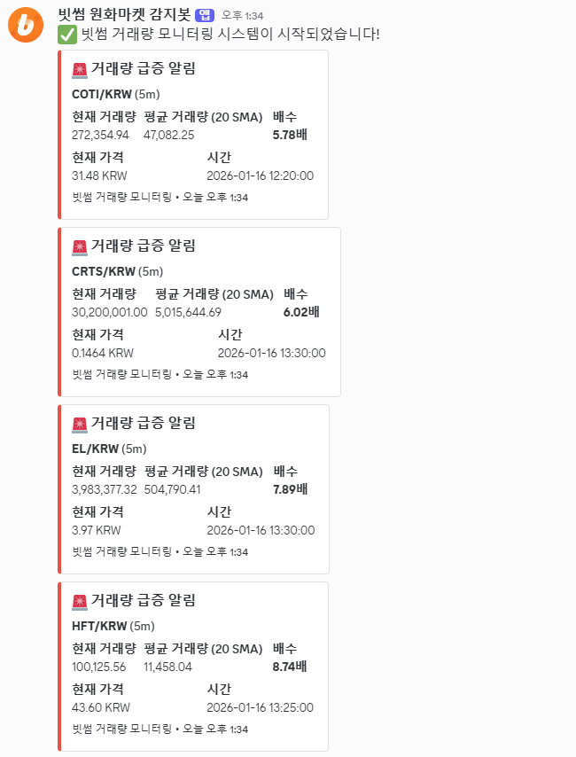
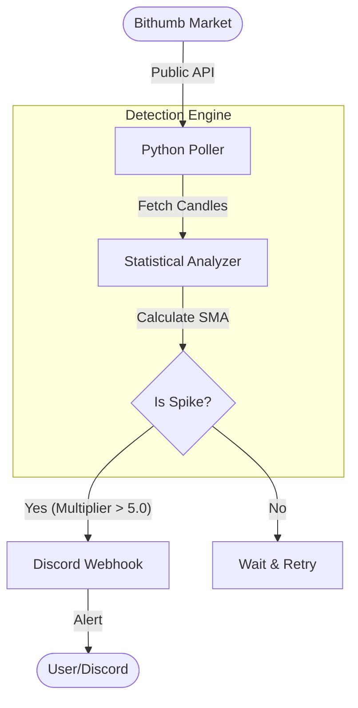

# Bithumb Volume

<div align="center">
  
  
  <br />

  
  
  
</div>

<br />

**Bithumb Volume**은 **빗썸 API**와 **이동평균(SMA) 기반 이상 탐지 알고리즘**을 활용한 실시간 가상화폐 거래량 모니터링 시스템입니다.
전체 마켓을 스캔하여 통계적 임계치를 초과하는 거래량 급증이 발생할 경우, Discord Webhook을 통해 실시간 알림을 전송합니다.

---

## 🛠 Features

*   **Market-Wide Scanning**: 빗썸 KRW 마켓의 모든 암호화폐를 주기적으로 스캔하여 사각지대 없는 모니터링 제공
*   **Anomaly Detection**: `현재 거래량 > SMA(20) * 5.0` 등 통계적 규칙 기반으로 유의미한 거래량 폭발 포착
*   **Real-time Alert**: 티커, 급등 배수(Multiplier), 평균 거래량 정보를 포함한 리포트를 Discord로 즉시 전송
*   **Robust Polling**: API Rate Limit을 준수하며, 에러 발생 시 자동 복구되는 견고한 폴링 아키텍처
*   **Configurable Strategy**: SMA 기간, 감지 민감도(Multiplier), 캔들 간격을 환경변수로 유연하게 조정 가능

---

## 🏗 Architecture



---

## 📦 Tech Stack

| Category | Technology |
| :--- | :--- |
| **Language** | Python 3.8+ |
| **Data Source** | Bithumb Public API |
| **Analysis** | Statistics, Math (Standard Lib) |
| **Notification** | Discord Webhook |
| **DevOps** | Nohup (Background Process) |

---

## 🚀 Getting Started

### Prerequisites
*   Python 3.8+
*   Discord Webhook URL

### Installation

1.  **Repository Clone**
    ```bash
    git clone https://github.com/jeonsavvy/Bithumb-Volume-Monitor.git
    cd Bithumb-Volume-Monitor
    ```

2.  **Virtual Environment (Optional)**
    ```bash
    python -m venv venv
    
    # Windows
    venv\Scripts\activate
    # macOS/Linux
    source venv/bin/activate
    ```

3.  **Dependencies Install**
    ```bash
    pip install -r requirements.txt
    ```

4.  **Environment Setup**
    `env.example`을 복사하여 `.env` 파일을 생성합니다.
    ```env
    DISCORD_WEBHOOK_URL=your_webhook_url
    CHECK_INTERVAL=60       # 폴링 주기 (초)
    VOLUME_MULTIPLIER=5.0   # 감지 임계값 (배수)
    ```

5.  **Run Monitor**
    ```bash
    # Foreground
    python main.py
    
    # Background (Linux/Mac)
    nohup python main.py > monitor.log 2>&1 &
    ```

---

## 📂 Directory Structure

```bash
├── main.py              # Main Entry Point & Logic
├── env.example          # Env Template
├── requirements.txt     # Dependencies
└── README.md
```
